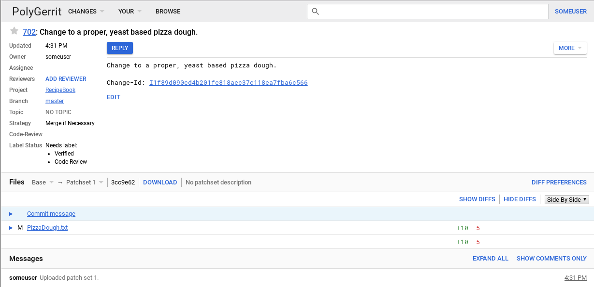
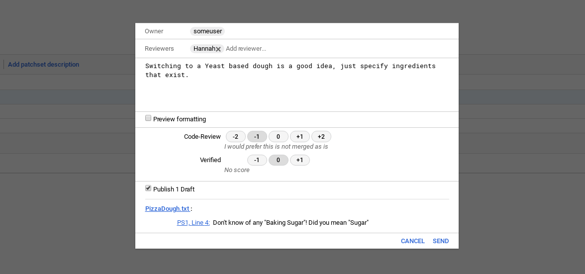

# Git – Gerrit Essentials

Gerrit is a Git server that provides access control for the hosted Git repositories.

1. [Gerrit Project Setup](#gerrit-project-setup)
2. [Update Local User Name and Email](#update-local-user-name-and-email)
3. [Before Pushing a Commit to Gerrit Remote](#before-pushing-a-commit-to-gerrit-remote)
4. [Drop Stash](#drop-stash)
5. [See Changes in one File](#see-changes-in-one-file)
6. [Show Last Modifier of a Line](#show-last-modifier-of-a-line)
7. [Filter Commit History](#filter-commit-history)
8. [Checkout by Commit ID](#checkout-by-commit-id)
9. [Cherry Pick](#cherry-pick)
10. [References](#references)

## Gerrit Project Setup

### Clone Gerrit Project

```sh
git clone ssh://gerrithost:29418/RecipeBook.git RecipeBook
```

```console
> Cloning into RecipeBook...
```

After he clones the repository, he runs a couple of commands to add a Change-Id to his commits. This ID allows Gerrit to link together different versions of the same change being reviewed.

```sh
scp -p -P 29418 gerrithost:hooks/commit-msg RecipeBook/.git/hooks/
chmod u+x .git/hooks/commit-msg
```

Or you can use all-in-one command:

```sh
git clone "ssh://gerrithost:29418/RecipeBook.git RecipeBook" && (cd "RecipeBook" && mkdir -p `git rev-parse --git-dir`/hooks/ && curl -Lo `git rev-parse --git-dir`/hooks/commit-msg https://gerrithost:29418/tools/hooks/commit-msg && chmod +x `git rev-parse --git-dir`/hooks/commit-msg)
```

### Upload a change

The commit must be pushed to a ref in the `refs/for/` namespace which defines the target branch: `refs/for/<target-branch>`

- Without Gerrit: updates the remote branch directly. `git push origin <branch>`
- With Gerrit review workflow: pushes to `refs/for/<branch>` for code review instead of directly updating the branch. `git push origin HEAD:refs/for/<branch>`

**Push for Code Review**

```sh
git commit
git push origin HEAD:refs/for/master
```

**Push with bypassing Code Review**
```sh
git commit
git push origin HEAD:master
```

```console
$ git commit
[master 3cc9e62] Change to a proper, yeast based pizza dough.
 1 file changed, 10 insertions(+), 5 deletions(-)
$ git push origin HEAD:refs/for/master
Counting objects: 3, done.
Delta compression using up to 8 threads.
Compressing objects: 100% (2/2), done.
Writing objects: 100% (3/3), 532 bytes | 0 bytes/s, done.
Total 3 (delta 0), reused 0 (delta 0)
remote: Processing changes: new: 1, done
remote:
remote: New Changes:
remote:   http://gerrithost/#/c/RecipeBook/+/702 Change to a proper, yeast based pizza dough.
remote:
To ssh://gerrithost:29418/RecipeBook
 * [new branch]      HEAD -> refs/for/master
```

Notice the reference to a `refs/for/master` branch. Gerrit uses this branch to create reviews for the **master** branch. If Max opted to push to a different branch, he would have modified his command to git push origin `HEAD:refs/for/<branch_name>`. When a commit is pushed for review, Gerrit stores it in a staging area which is a branch in the special refs/changes/ namespace. 

### Gerrit Code Review Screen




### Reviewing the Change

- Selecting Open from the Changes menu
- Setting up email notifications to stay informed of changes even if you are not added as a reviewer

**Code-Review**: This check requires that someone look at the code and ensures that it meets project guidelines, styles, and other criteria.

**Verified**: This check means that the code actually compiles, passes any unit tests, and performs as expected.

⚠️ The Code-Review and Verified checks require **different permissions** in Gerrit. This requirement allows teams to separate these tasks. For example, an automated process can have the rights to verify a change, but not perform a code review.

> Click the `REPLY` button on the change screen. This allows you to vote on this change.



- +2 Looks good to me, approved
- +1 Looks good to me, but someone else must approve
- 0 No score
- -1 I would prefer this is not submitted as is
- -2 This shall not be submitted

⚠️ A change must have at least one +2 vote and no -2 votes before it can be submitted. These numerical values do not accumulate. Two +1 votes do not equate to a +2.


## Update Local User Name and Email
```sh
git config user.name "atalayp"
git config user.email "atalayp@gmail.com"
```

## Before Pushing a Commit to Gerrit Remote

If you have unstaged changes and don't want to push them, you can use `git stash` to temporarily save your changes. This allows you to push your commits without including the unstaged changes.

```sh
git stash push -u -m "Stash before pushing commit"
```

- `-u`: Stashes untracked files as well.
- `-m`: Adds a message to the stash for easier identification.

Verify that your working directory is clean:

```sh
git status
```

Fetch latest changes:

```sh
git fetch origin
```

Rebase your commits on top of the latest changes from the remote branch:

```sh
git rebase origin/<branch>
```

If conflict occurs, fix them manually, stage the resolved files, and continue the rebase process:

```sh
git add <resolved-file>
git rebase --continue
```

Push commits to Gerrit for review:

```sh
git push origin HEAD:refs/for/<branch>
```

Restore your stashed changes:
- To see the list of stashes and identify the one you want to apply

```sh
git stash list
```
- To apply the most recent stash

```sh
git stash pop
```

If conflict occurs, fix them manually, stage the resolved files.

```sh
git add <resolved-file>
```

### Cleaner Alternative Method

Before pushing the commits:

```sh
git pull --rebase --autostash
```

OR

```sh
git rebase origin/<branch> --autostash
```

It automatically stashes your changes, rebases your commits on top of the latest changes from the remote branch, and then applies your stashed changes back to your working directory. This method is cleaner and more efficient as it eliminates the need for manual stash management.

## Drop Stash

Inspect the list of stashes to identify the one you want to drop:

```sh
git stash list
```

You can inspect the contents of a specific stash to ensure you are dropping the correct one:

```sh
git stash show -p stash@{<index>}
```

Drop Stash:

```sh
git stash drop stash@{<index>}
```

Drop the latest stash:

```sh
git stash drop
```

Drop all stashes:

```sh
git stash clear
```

## See Changes in one File

### In working tree (unstaged changes):

```sh
git diff <file>
```

- `file`: The name of the file you want to see the changes for (If the file is in the inner directory, include the relative path from the current directory).


### In staged changes:

```sh
git diff --cached <file>
```

### Between branches

```sh
git diff origin/<branch> -- <file>
```

### In Commit History

```sh 
git log -p <file>
```

- `-p`: Shows the patch (diff) introduced in each commit for the specified file.

```sh 
git log -p --oneline --graph <file>
```
- `--oneline`: Displays each commit on a single line, showing the commit hash and message.
- `--graph`: Adds a visual representation of the commit history, showing branches and merges.

## Show Last Modifier of a Line

Blame specific lines in a file to see who last modified them:

```sh
git blame -L <start>,<end> <file>
```

> Example:
> ```sh
> git blame -L 10,20 src/main/java/com/example/MyClass.java
> ```

## Filter Commit History

To filter commit history based on specific criteria, you can use the `git log` command with various options. Here are some common filters:

### Keyword Search in Commit Messages:

```sh
git log --grep="<keyword>" -i
```
- `--grep="<keyword>"`: Filters commits that contain the specified keyword in their commit message.
- `-i`: Makes the search case-insensitive.
- It uses ReGex pattern matching, so you can use regular expressions to refine your search.

Search in all branches:

```sh
git log --all --grep="<keyword>" -i
```

Combine with file filtering:

```sh
git log --grep="<keyword>" -i -- <file>
```

### Filter history by author:

```sh
git log --author="<author_name>"
```

> Example:
> ```sh
> git log --author="atalayp"
> git log --author="atalayp@gmail.com"
> ```

### Filter history by committer:

```sh
git log --committer="<committer_name>"
```

> Example:
> ```sh
> git log --committer="atalayp"
> git log --committer="atalayp@gmail.com"
> ```

### Filter history by date:

```sh
git log --since="<date>" --until="<date>"
```
- `--since="<date>"`: Shows commits that are newer than the specified date.
- `--until="<date>"`: Shows commits that are older than the specified date.

> Example:
> ```sh
> git log --since="2024-01-01" --until="2024-12-31"
> ```


```sh
git log --until="2 weeks ago"
git log --until="2024/02/01"
git log --until="Feb 1 2024"
```

### Filter history by commit hash:

```sh
git log <commit_hash>
```

### Combine multiple filters:

```sh
git log --author="<author_name>" --since="<date>" --until="<date>" --grep="<keyword>" -i
```

## Checkout by Commit ID

```sh
git checkout <commit_id>
```
- DETACHED HEAD state: When you checkout a specific commit, you are in a detached HEAD state, which means you are not on any branch. Any new commits you make will not be associated with a branch unless you create a new branch from that point.

Go back to the previous branch:

```sh
git checkout -
```

Return to the latest commit (local HEAD) on the current branch:

```sh
git checkout <branch_name>
```

## Cherry Pick

Specific commit, but NOT the rest of the commits in the branch. Copies a commit from one place and re-applies it to another branch. This is useful when you want to apply a specific change without merging the entire branch. It creates a new commit with the same changes but a different commit hash.

> ```
> feature-A: A -- B -- C
> develop:   D -- E
> 
> git checkout develop
> git cherry-pick <commit_id_of_B>
> 
> develop:   D -- E -- B'
> ```

```sh
git checkout <branch>
```

```sh
git cherry-pick <commit_id>
```

Gerrit patch transfer between branches:
- If a change is approved on `develop` branch and you want to apply the same change to `master` branch, you can cherry-pick the commit from `develop` to `master` and push it for review.

```sh
git checkout master
git cherry-pick -x <commit_id>
```
- `-x`: Appends a line to the original commit message indicating which commit was cherry-picked. This is useful for tracking the origin of the change.

Handling conflicts during cherry-pick:
- Manually resolve the conflicts in the affected files, stage the resolved files, and continue the cherry-pick process.

```sh
git add <resolved-file>
git cherry-pick --continue
```

If needed:
- To abort the cherry-pick process and return to the previous state before starting the cherry-pick:

```sh
git cherry-pick --abort
```

Cherry-pick multiple commits:

```sh
git cherry-pick <commit_id1> <commit_id2> <commit_id3>
```

## References

[Working with Gerrit: An example](https://gerrit-review.googlesource.com/Documentation/intro-gerrit-walkthrough.html)

[User Guide](https://gerrit-review.googlesource.com/Documentation/intro-user.html)

---
